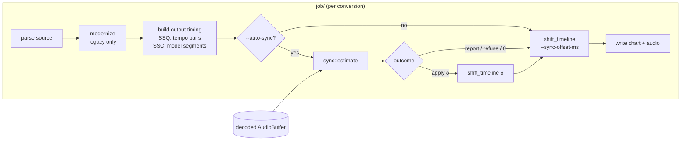

# Auto-Sync: Detailed Design

Status: Approved 2026-09-28

## Overview

`ddr-chart-tools` converts charts and audio between DDR (SSQ + XWB) and
StepMania 5 (SSC/SM + OGG), and modernizes legacy DDR SSQs. Today a
converted chart is exactly as in sync as its source: the tool trusts the
source's `#OFFSET` or tempo chunk. Many sources are off by a few
milliseconds, and some legacy titles by tens of milliseconds. Fixing them
currently means a round trip through StepMania and ArrowVortex, nudging the
offset by eye:

1. Convert to SM5.
2. Nudge the offset in ArrowVortex until the chart lines up with the audio.
3. Export a new SSC.
4. Convert back to DDR.

This feature adds an opt-in `--auto-sync` flag. It measures where the
chart's notes fall relative to the audio's rhythmic onsets and moves the
chart by the measured error, bounded to ±60 ms by default. The correction
is chart-side only: the audio is never modified.

The design rests on a throwaway prototype run over the stock DDR World
catalogue (1,434 songs). The prototype was scored against a
community-maintained, play-validated per-song offset database. On that
reference the method agrees within 1 ms for 91% of songs and within 2 ms
for 97%. That is at the resolution limit of both the reference (whole ms)
and the game itself: DDR World rounds every tempo anchor to a whole
millisecond (verified in the executable; see Appendix A.5).

## Detailed Requirements

### Functional

1. **R1 — Opt-in flag on every conversion.** `--auto-sync` is accepted for
   all four supported conversions: `DDR → SM5`, `SM5 → DDR`,
   `DDR_LEGACY → DDR`, `DDR_LEGACY → SM5`. It is never on by default.
2. **R2 — Modes.**
   - `--auto-sync` (equivalently `--auto-sync apply`) measures and corrects.
   - `--auto-sync report` measures and logs the correction it would apply,
     then writes outputs with the source sync unchanged.
3. **R3 — Cap.** `--auto-sync-max-ms N` (default 60; valid 1–200) bounds the
   applied correction. It is only valid alongside `--auto-sync`. The
   default covers the ~53 ms console-to-arcade offset seen on Ultramix
   material.
4. **R4 — Whole-song estimation.** The offset is estimated by correlating an
   onset-strength envelope of the audio against *every* chart event time.
   There is no snapping to a single beat and no tempo estimation; BPMs and
   stops are trusted.
5. **R5 — Template.** Chart events are the union of note positions across
   all difficulties, each weighted by the number of charts with a note
   there.
   - Taps, hold heads, and shocks count.
   - Mines do not count.
   - A chart contributes at most once per position.
6. **R6 — Target.** "In sync" means the measured offset equals a calibrated
   constant `TARGET_OFFSET_MS`. It is derived from stock DDR World songs and
   the community offset database, and absorbs the detector's own latency.
   The same target applies to SM5 output.
7. **R7 — Refusal.** When the estimate is untrustworthy, the source sync is
   left unchanged, a `warn!` explains why, and the conversion still
   succeeds. Refusal conditions:
   - fewer than 32 usable chart events;
   - no decodable audio;
   - the required correction exceeds the cap;
   - the peak lies within 3 ms of the search edge;
   - a rival peak more than 15 ms away scores ≥ 0.9 of the best;
   - estimates from the first and second halves of the song differ by more
     than 5 ms.
8. **R8 — Resolution.** The applied correction is the estimate rounded to a
   whole millisecond (half away from zero). A correction that rounds to 0
   changes nothing. There is no other dead-band.
9. **R9 — Chart-side only.** Correction moves the chart relative to
   unchanged audio. On SSQ output, every `tempo_data` entry moves by δ ms.
   On SSC output, `#OFFSET` moves by −δ/1000 s. Audio bytes, preview slices,
   and the legacy XWB passthrough are untouched.
10. **R10 — Ordering.** Per job: parse → modernize (legacy only) → build the
    output timing → auto-sync (measure, then shift) → `--sync-offset-ms`
    bias → write. The bias stays a per-target engine correction layered on
    top of the synced chart (business rule 10).
11. **R11 — Fix the existing shift primitive.** `--sync-offset-ms` must move
    the whole chart on every path.
    - Today `apply_sync_offset` (`src/job/mod.rs`) adds the bias to
      `raw_tempo_pairs[0]` only. On DDR output that bends the first tempo
      segment instead of moving the chart: on a single-BPM song the
      correction tapers from N ms at beat 0 to 0 at the end.
    - The bias is also silently ignored on `SM5 → DDR` and `DDR → SM5`.
    - Both auto-sync and the bias use one uniform shift operation.
12. **R12 — Reporting.**
    - Every song processed with `--auto-sync` logs one `info!` line: the
      measured correction, the applied correction or refusal, the rival
      ratio, and the split-half difference.
    - The line has a stable `key=value` tail so a batch can be grepped.
    - Refusals log at `warn!`.
13. **R13 — Calibration is reproducible.** An ignored, environment-gated
    test runs the production estimator over a stock DDR World install and
    the community offset CSV. It fails if `TARGET_OFFSET_MS` is stale by
    more than 0.1 ms or agreement falls below the thresholds in Testing
    Strategy.

### Non-functional

- **Performance:** ≤ 2 s of analysis per song in a release build. The
  prototype measured about 60 ms of MS-ADPCM decode plus about 150 ms of
  envelope computation per song, single-threaded.
- **Architecture:** synchronous, single-threaded; no new runtime
  dependencies beyond `rustfft`.
- **Determinism:** same input, same output, on one platform. Floating-point
  results may differ across CPUs by far less than 1 ms, which rounding (R8)
  absorbs.

### Assumptions the design rests on

- Stock DDR World charts, corrected by the community database, are the
  definition of "in sync" for DDR World. A well-synced DDR World chart is
  also well synced in StepMania; SM5 output is checked by eye in
  ArrowVortex.
- Real source errors that users want fixed are within about ±60 ms.
  Errors approaching half a beat (150–200 ms at 150–200 BPM) cannot be
  measured reliably by any onset method on this music (Appendix A.3). They
  are out of scope and produce a refusal or no change.
- The community database is a calibration and validation input only. The
  tool never reads it at runtime.
- A correction may make `tempo_data[0]` negative (beat 0 before the audio
  starts), by up to the cap. Stock DDR World files use values down to
  about −22 ms, and `SM5 → DDR` already emits negative values for simfiles
  with a positive `#OFFSET`. Larger negative values are confirmed in-game
  during manual validation.
- Some community values are believed to be outdated (e.g. `tiho`, whose
  current community value now matches this design's estimate). Acceptance
  is "agrees for the large majority of songs", not agreement on every song.

### Out of scope

- BPM detection or correction.
- Drift correction, per-section offsets, per-chart offsets.
- Audio resampling or trimming.
- Applying community offsets during conversion.
- Errors beyond the cap.
- **Follow-up (separate change):** `DDR → SM5` of TPS ≠ 1000 sources should
  read tempo anchors the way the game does (integer-ms normalization,
  Appendix A.5). Today it uses exact `value / TPS`, up to about 0.5 ms per
  anchor away from what DDR plays.

## Architecture Overview

A new top-level module, `src/sync/`, owns onset analysis and offset
estimation. It is pure computation over an `AudioBuffer` and a list of
weighted event times: no I/O, no format knowledge beyond reading a
`(measure_tick, ms)` tempo-pair list. The job layer:

- builds the event list from the timing each output format will actually
  carry;
- calls the estimator;
- applies the result through a single timeline-shift primitive, which also
  serves `--sync-offset-ms`.

This overrides the steering rule against new top-level modules. Onset
detection is a concern none of the existing modules owns:

- `model/` holds types and invariants;
- `util/` excludes domain logic;
- `job/` is orchestration;
- the format modules own byte layouts.

The steering documents are updated in the same change (see Documentation
Changes).



Where each path gets its timing and audio:

| Conversion | Output timing used for event times | Audio for analysis | Shift applied to |
|---|---|---|---|
| `SM5 → DDR` | final synthesized tempo pairs (TPS 1000) | OGG decode (already done) | pairs + model offset |
| `DDR_LEGACY → DDR` | modernized + extended raw pairs (TPS 1000) | XWB/WAVM decode. The XWB passthrough path decodes *only* when auto-sync is on. | pairs + model offset |
| `DDR → SM5` | model `tempo_segments` + `stops` + offset | XWB decode (already done) | model offset (`#OFFSET`) |
| `DDR_LEGACY → SM5` | model `tempo_segments` + `stops` + offset | XWB/WAVM decode (already done) | model offset (`#OFFSET`) |

Using the output's own timing matters for legacy sources. The tempo parser
drops "instant advance" pairs when building `tempo_segments`
(`src/ssq/tempo.rs`), so the SSQ and SSC outputs of one legacy chart can
place notes slightly differently. Each output is measured against what it
will actually play.

```mermaid
flowchart TB
    subgraph sync["src/sync/"]
        TM[TimeMap<br/>beat → seconds] --> EV[chart_events<br/>weighted union of notes]
        AU[AudioBuffer] --> ON[onset::envelope<br/>10 ms window, rising edge]
        ON --> SC[score curve<br/>Σ wᵢ·env(tᵢ + d)]
        EV --> SC
        SC --> PK[peak + parabolic refine<br/>rival ratio, edge check]
        EV --> HV[split-half estimates]
        ON --> HV
        PK --> OUT[SyncEstimate<br/>Apply δ / Unchanged / Refused]
        HV --> OUT
    end
```

## Components and Interfaces

### CLI (`src/cli/`)

New arguments on `Cli`; clap derive stays in `src/cli/`:

```rust
/// Measure how far the chart is from the audio and correct it
/// (`apply`, the default when the flag is given bare), or only log
/// the correction that would be applied (`report`).
#[arg(long, value_enum, num_args = 0..=1, default_missing_value = "apply")]
pub auto_sync: Option<AutoSyncMode>,

/// Largest correction auto-sync may apply, in ms (default 60).
#[arg(long)]
pub auto_sync_max_ms: Option<u32>,
```

`Cli::validate()` gains:

- `AutoSyncMaxRequiresAutoSync` when `--auto-sync-max-ms` is given without
  `--auto-sync`;
- `AutoSyncMaxOutOfRange { ms }` outside 1–200.

`into_plan` threads `Option<AutoSync>` into every `Job`. The
`--sync-offset-ms` help text changes from "adds N to `tempo_data[0]`" to
"moves every tempo anchor by N ms (and `#OFFSET` by −N/1000 s)".

### Job types (`src/cli/job.rs`)

```rust
/// What `--auto-sync` should do with its measurement.
#[derive(Debug, Clone, Copy, PartialEq, Eq, ValueEnum)]
pub enum AutoSyncMode {
    /// Measure and correct the chart.
    Apply,
    /// Measure and log only; outputs keep the source sync.
    Report,
}

/// Auto-sync settings for one job.
#[derive(Debug, Clone, Copy, PartialEq, Eq)]
pub struct AutoSync {
    pub mode: AutoSyncMode,
    /// Cap on the applied correction, in whole ms.
    pub max_correction_ms: u32,
}

pub struct Job {
    // ...existing fields...
    /// `None` unless `--auto-sync` was given.
    pub auto_sync: Option<AutoSync>,
}
```

The doc comment on `Job::sync_offset_ms` changes to "applied on every
conversion".

### Sync module (`src/sync/`)

| File | Owns |
|---|---|
| `mod.rs` | Public API: `estimate`, `SyncEstimate`, `Outcome`, `Refusal`, `Params`, `TARGET_OFFSET_MS`, and the tuning constants (Data Models) |
| `timemap.rs` | `TimeMap`: piecewise-linear beat → seconds, built from SSQ tempo pairs or from `Song` segments/stops/offset |
| `events.rs` | `chart_events(charts, &TimeMap) -> Vec<SyncEvent>` (R5) |
| `onset.rs` | `Envelope` and `envelope(&AudioBuffer) -> Option<Envelope>` |
| `estimate.rs` | Score curve, peak picking, rival ratio, split-half, verdict |

Public functions:

```rust
/// Measure the chart-vs-audio offset and decide whether and how far
/// to move the chart. Never fails: untrustworthy inputs yield
/// `Outcome::Refused`.
pub fn estimate(audio: &AudioBuffer, events: &[SyncEvent], params: &Params) -> SyncEstimate;

impl TimeMap {
    /// From `(measure_tick, tempo_data)` pairs at `tps` (SSQ output paths).
    pub fn from_tempo_pairs(pairs: &[(i32, i32)], tps: u32) -> Option<TimeMap>;
    /// From the model's semantic timing (SSC output paths).
    pub fn from_song(song: &Song) -> Option<TimeMap>;
    /// Audio time of `beat`, in seconds.
    pub fn seconds_at(&self, beat: f64) -> f64;
}

pub fn chart_events(charts: &[Chart], map: &TimeMap) -> Vec<SyncEvent>;
```

#### `TimeMap` semantics

- **Anchors** are `(beat: f64, seconds: f64)`, sorted by beat. A stop is two
  anchors at the same beat.
- **A note exactly on a stop** takes the stop's *first* anchor: DDR plays it
  at the start of the stop.
- **Between anchors** the map interpolates linearly. Outside them it
  extrapolates from the nearest segment with a nonzero beat span.
- **`from_tempo_pairs`** converts ticks to beats as `tick / 1024` and ms to
  seconds as `tempo_data / tps`. On SSQ output paths the pairs are always
  TPS 1000 whole-ms values, which is exactly what DDR World plays (Appendix
  A.5).
- **`from_song`** mirrors the SSQ writer's synthesis walk
  (`synthesize_tempo_entries_until`), in `f64`: the earliest `#BPMS` entry
  applies from beat 0, and segment boundaries and stops merge in beat order.
  `f64` is ample for analysis; it is never written to disk.

#### Estimator algorithm

These are exactly the parameters validated by the prototype. Changing any of
them invalidates `TARGET_OFFSET_MS` until recalibrated.

1. **Mono.** Average all channels; scale by 1/32768 to `f32`.
2. **Envelope ("rising edge").** For each frame:
   - Window and hop: Hann window of `round(0.010·sr)` samples, zero-padded to
     the next power of two; hop of `round(sr·32/44100)` samples (32 at
     44.1 kHz, about 0.73 ms).
   - Frame energy:
     `E = Σ_k w(f_k)·log2(|X_k|² + 1e-9)` over bins with 30 Hz ≤ f_k ≤ 16 kHz,
     where `w(f) = f·e^(−f/3000)/1103.6`.
   - Envelope value: `env[t] = E[t] − E[t−L]`, signed, not rectified, where
     `L = max(1, round(0.002·sr/hop))` (3 frames at 44.1 kHz). Frames before
     `L` are 0.
   - Frame `t` is attributed to time `(win/2)/sr − L·hop/(2·sr) +
     t·hop/sr`. Any constant bias here is absorbed by `TARGET_OFFSET_MS`.
3. **Events.**
   - Keep only events at least `H/1000 + 0.1` s inside both ends of the
     envelope, where `H = cap + 10`.
   - Fewer than 32 remaining → `Refused(TooFewEvents)`.
4. **Score curve.**
   - `S(d) = Σ_i w_i · env(t_i + d/1000)`, with linear interpolation of
     `env` and 0 outside it.
   - `d` is every integer ms in `[round(T) − H, round(T) + H]`, where
     `T = TARGET_OFFSET_MS`.
   - The search runs 10 ms beyond the cap so corrections near the cap are
     not truncated by the window edge. At ±55 ms synthetic error this raised
     acceptance from 72–76% to 91–94%.
5. **Peak.**
   - `i* = argmax S`.
   - Refine parabolically through `S[i*−1], S[i*], S[i*+1]`; the refined
     position is `m`, the measured offset.
   - Peak within 3 samples of either end → `Refused(AtSearchEdge)`.
6. **Rival ratio.**
   - Let `med` be the median of `S`.
   - `rival` = the maximum over local maxima `j` with `|j − i*| > 15` of
     `(S[j] − med) / (S[i*] − med)`; 1.0 if `S[i*] ≤ med`.
   - `rival ≥ 0.9` → `Refused(AmbiguousPeak)`.
7. **Split halves.**
   - Sort events by time and split at `n/2`.
   - Compute each half's refined argmax on its own score curve.
   - `split = |m₁ − m₂|`; `split > 5` → `Refused(HalvesDisagree)`.
8. **Verdict.**
   - `correction = m − T`.
   - `|correction| > cap` → `Refused(BeyondCap)`.
   - Otherwise `δ = round_half_away(correction)`: `δ == 0` →
     `Outcome::Unchanged`, else `Outcome::Apply { delta_ms: δ }`.
   - A positive δ moves the chart later.

Refusal checks run in the order listed, so the first applicable reason is
reported.

Sign conventions, stated once:

- `m` is audio onset time minus chart event time.
- A positive correction moves the chart later: add δ to every `tempo_data`,
  or subtract δ/1000 from `#OFFSET`.
- This matches `--sync-offset-ms` and the model's
  `audio_sync_offset_seconds`.

### Job orchestration (`src/job/`)

A new submodule, `src/job/sync_offset.rs`, owns:

```rust
/// Move the whole chart `delta_ms` later relative to the audio:
/// adds δ to every `tempo_data` value in `tempo_pairs` (TPS 1000)
/// and δ/1000 s to `song.audio_sync_offset_seconds`. BPMs and stops
/// are unchanged because every anchor moves together.
pub(super) fn shift_timeline(
    song: &mut Song,
    tempo_pairs: &mut [(i32, i32)],
    delta_ms: i32,
) -> Result<(), JobError>;

/// Run auto-sync for one job and apply the result if the mode is
/// `Apply`. Logs the outcome. Returns the applied delta (0 if none).
pub(super) fn auto_sync(
    job: &Job,
    cfg: AutoSync,
    audio: &AudioBuffer,
    map: &TimeMap,
    song: &mut Song,
    tempo_pairs: &mut [(i32, i32)],
) -> Result<i32, JobError>;
```

- `shift_timeline` replaces `apply_sync_offset`.
- The `SSC` paths pass an empty `tempo_pairs` slice.
- For `DDR_LEGACY → SM5` the raw pairs are shifted too; they are not written,
  and keeping them consistent costs nothing.

Path changes in `src/job/mod.rs`:

- **`sm5_to_ddr`**
  1. Synthesize the tempo pairs and events as today.
  2. `TimeMap::from_tempo_pairs(&tempo_pairs, 1000)`, then `auto_sync`.
  3. `shift_timeline(job.sync_offset_ms)` (newly applied on this path).
  4. Write.
- **`legacy_to_ddr`**
  1. Modernize, then `synthesize_events`.
  2. If auto-sync is on, decode the audio for analysis even when the XWB
     passthrough will byte-copy it. A decode failure is a `warn!` and a
     skipped auto-sync, never a job failure.
  3. `auto_sync`, then `shift_timeline(bias)`, then write.
- **`ddr_to_sm5`**
  1. After decoding, `TimeMap::from_song`, then `auto_sync`.
  2. `shift_timeline(bias)` (newly applied on this path).
  3. Write.
- **`legacy_to_sm5`**
  1. Modernize, decode.
  2. `TimeMap::from_song`, then `auto_sync`.
  3. `shift_timeline(bias)`, then write.

### Logging (R12)

| Level | When | Example |
|---|---|---|
| `info!` | applied | `song.ssq: auto-sync moved chart +7 ms later (measured +6.8 ms) — auto_sync=apply delta_ms=7 measured_ms=6.81 rival=0.21 split_ms=0.9 events=412` |
| `info!` | already in sync | `song.ssq: auto-sync: already in sync (measured +0.3 ms) — auto_sync=unchanged ...` |
| `info!` | report mode | `song.ssq: auto-sync (report) would move chart −12 ms — auto_sync=report delta_ms=-12 ...` |
| `warn!` | refused | `song.ssq: auto-sync left sync unchanged: halves disagree by 8.4 ms (tempo may drift) — auto_sync=refused reason=halves_disagree ...` |
| `debug!` | always with auto-sync | envelope frame count, search range, peak value, cap |

Refusal messages say what the user can do:

- `BeyondCap`: "sync looks off by about X ms, beyond the ±N ms cap; raise
  `--auto-sync-max-ms` or fix by hand".
- `HalvesDisagree`: "tempo may drift or the song may be cut".
- `AmbiguousPeak`: "two alignments fit about equally well".

## Data Models

```rust
/// One weighted chart event: when it is heard, and how many
/// difficulties place a note there.
#[derive(Debug, Clone, Copy, PartialEq)]
pub struct SyncEvent {
    pub time_s: f64,
    pub weight: f64,
}

/// Onset-strength envelope: one value per analysis frame.
pub struct Envelope {
    values: Vec<f32>,
    /// Time (s) of frame 0.
    t0_s: f64,
    /// Seconds per frame.
    dt_s: f64,
}

/// Caller-controlled estimation parameters.
#[derive(Debug, Clone, Copy)]
pub struct Params {
    /// Largest correction that may be applied, in whole ms.
    pub max_correction_ms: u32,
}

/// Result of one estimate. Every measured field is `None` when the
/// estimator refused before measuring.
#[derive(Debug, Clone, PartialEq)]
pub struct SyncEstimate {
    pub outcome: Outcome,
    /// Refined peak position `m` (ms): audio onset minus chart time.
    pub measured_ms: Option<f64>,
    /// `m − TARGET_OFFSET_MS`: how far later the chart should move.
    pub correction_ms: Option<f64>,
    pub rival: Option<f64>,
    pub split_ms: Option<f64>,
    pub events_used: usize,
}

#[derive(Debug, Clone, Copy, PartialEq, Eq)]
pub enum Outcome {
    /// Move the chart `delta_ms` later (negative = earlier).
    Apply { delta_ms: i32 },
    /// The correction rounds to 0 ms.
    Unchanged,
    Refused(Refusal),
}

#[derive(Debug, Clone, Copy, PartialEq, Eq)]
pub enum Refusal {
    NoAudio,
    TooFewEvents,
    AtSearchEdge,
    AmbiguousPeak,
    HalvesDisagree,
    BeyondCap,
}
```

Constants in `src/sync/mod.rs`, each with a doc comment explaining its
origin:

| Constant | Value | Origin |
|---|---|---|
| `TARGET_OFFSET_MS` | −2.10 (prototype; re-derived by the calibration test) | median of measured + community offset over TPS 1000 stock songs |
| `DEFAULT_MAX_CORRECTION_MS` | 60 | maintainer decision; covers ~53 ms legacy offset |
| `MAX_CORRECTION_LIMIT_MS` | 200 | CLI validation ceiling |
| `SEARCH_MARGIN_MS` | 10 | window-edge truncation fix |
| `EDGE_MARGIN_SAMPLES` | 3 | peak-at-edge refusal |
| `RIVAL_EXCLUSION_MS` | 15 | neighborhood of the main peak |
| `RIVAL_REFUSE_RATIO` | 0.9 | ambiguity refusal |
| `SPLIT_REFUSE_MS` | 5.0 | split-half refusal |
| `MIN_EVENTS` | 32 | too-few-events refusal |
| window / hop / band / emphasis / lag | 10 ms / 32⁄44100 s / 30 Hz–16 kHz / f·e^(−f/3 kHz) / 2 ms | prototype feature `rise` |

No model type changes. `Song::audio_sync_offset_seconds` keeps its
documented DDR sign convention.

## Error Handling

The estimator has no error type: every failure mode is a `Refusal`, per
R7. Remaining errors are orchestration-level:

| Condition | Handling |
|---|---|
| Audio decode fails when decoding *only* for analysis (legacy XWB passthrough) | `warn!`, skip auto-sync, conversion continues |
| Audio decode fails on a path that converts audio anyway | Existing error propagation (unchanged) |
| `shift_timeline` overflows `i32` in a `tempo_data` entry, or the rational offset overflows | New `JobError::SyncShiftOverflow { delta_ms }`, fatal for that job; practically unreachable because anchors stay below 2³¹ ms |
| `TimeMap` cannot be built (fewer than two anchors, no tempo segments) | `Refused(TooFewEvents)` through an empty event list; `warn!` |
| Invalid `--auto-sync-max-ms` or missing `--auto-sync` | `CliError` at validation (exit code 2) |

In batch mode an auto-sync refusal is never a job failure; only the errors
above that already fail jobs do.

## Testing Strategy

### Unit tests (beside the code)

- **`sync::onset`**
  - A synthetic 1 ms click train produces envelope peaks within one hop of
    each click, plus the attribution constant.
  - Silence gives a flat envelope.
  - 48 kHz input gives the same peak times as 44.1 kHz within 0.5 ms.
- **`sync::timemap`**
  - Single BPM.
  - BPM change.
  - Stop: a note on the stop maps to the stop's start.
  - Extrapolation before the first and past the last anchor.
  - `from_song` and `from_tempo_pairs` agree within 1 ms on songs whose
    pairs were synthesized from the same song.
- **`sync::events`**
  - Weights count charts, not notes.
  - Mines are excluded.
  - A tap and a hold head on the same position in one chart count once.
- **`sync::estimate`**, on short synthetic signals: noise bursts at event
  times plus low-level noise, 10–15 s long so debug builds stay fast.
  - Relative recovery: with the estimator's own baseline `m₀` on the
    unshifted signal, shifting the audio by X ∈ {−55, −30, −7, +1, +13, +40,
    +55} ms moves `m` by X ± 0.5 ms.
  - Each refusal reason is produced by a constructed case:
    - too few events;
    - an offset beyond the cap;
    - a peak forced to the search edge;
    - a two-alignment pattern (events duplicated at +20 ms with equal
      weight);
    - halves shifted by different amounts (drift);
    - empty audio.
  - Rounding: corrections of +0.49, +0.5, −0.5, −1.49 ms.
- **`job::sync_offset::shift_timeline`**
  - Every pair moves by δ, and slopes (BPMs) and stop lengths are unchanged.
  - Regression for the R11 bug: on a single-BPM song, the *last* pair moves
    too.
  - Model offset moves by δ/1000.
  - Overflow returns `SyncShiftOverflow`.
- **`cli`**
  - `--auto-sync` alone → `Apply`; `--auto-sync report` → `Report`.
  - `--auto-sync-max-ms` without `--auto-sync` is rejected; 0 and 201 are
    rejected.
  - `--sync-offset-ms` now reaches `SM5 → DDR` and `DDR → SM5` jobs.

### Integration tests (`tests/{from}_to_{to}.rs`)

Each test builds a small synthetic song in a temp directory:

- a chart (SSC text, or an SSQ written by the crate's own writer);
- audio synthesized as clicks at note times offset by a known X, encoded
  with the crate's own OGG or MS-ADPCM encoders.

For each of `sm5_to_ddr.rs`, `ddr_to_sm5.rs`, `ddr_legacy_to_ddr.rs`,
`ddr_legacy_to_sm5.rs`:

1. **Convergence.** Convert with `--auto-sync`, then convert the output with
   `--auto-sync report`. The second run reports |δ| ≤ 1 ms.
2. **Linearity.** Two sources differing only by an audio shift of 25 ms
   receive applied corrections differing by 25 ± 1 ms.
3. **Report mode is inert.** The output chart's timing is byte-identical to
   a run without `--auto-sync`.
4. **Bias composes.** `--auto-sync --sync-offset-ms 10` yields the
   auto-synced timing plus exactly 10 ms on every anchor.
5. **Legacy passthrough preserved.** On `DDR_LEGACY → DDR` with a compliant
   XWB, the output XWB and XSB are byte-identical to the input while the SSQ
   is shifted.

### Calibration test (`tests/auto_sync_calibration.rs`, `#[ignore]`)

This deliberately departs from the `{from}_to_{to}` naming: it validates a
constant, not a conversion.

- **Inputs:** `DDR_WORLD_INSTALL` and `DDR_SYNC_OFFSETS_CSV` environment
  variables. Skips with a message if either is unset.
- **Corpus:** every CSV row with a value whose SSQ
  (`$DDR_WORLD_INSTALL/data/mdb_apx/ssq/<code>.ssq`) has TPS 1000 and whose
  XWB (`data/sound/win/dance/<code>.xwb`) decodes.
- **Measurement:** the production estimator with default parameters and
  pre-verdict values (it needs `measured_ms` even for refused songs).
- **Asserts:**
  - `|median(m + c) − TARGET_OFFSET_MS| ≤ 0.1 ms`;
  - ≥ 90% of songs within 1 ms and ≥ 96% within 2 ms of the community
    value (prototype: 94.0% / 97.6% on this subset);
  - acceptance rate ≥ 93% (prototype: 95.6% on all songs).
- **Output:** prints the table needed to update the constant.
- **Run:** `cargo test --release --test auto_sync_calibration -- --ignored
  --nocapture`, about 3 minutes.

The CSV's value `c` is the negated community-tool output: "ms to add to
`#OFFSET`". Hence `m = T − c` and `T = median(m + c)`.

### Manual validation (plan-level, not CI)

- Report mode over the maintainer's Ultramix conversions, to replace the
  unvalidated +53 ms README guidance.
- A few converted songs checked in-game and in ArrowVortex.

## Documentation Changes

In the same changes as the code they describe:

- **`.spec/steering/structure.md`:** add `src/sync/` to the layout and the
  responsibilities table. `job/` gains "auto-sync orchestration and the
  timeline shift". Add `tests/auto_sync_calibration.rs` to the tests layout
  with its exception.
- **`.spec/steering/product.md`:**
  - Glossary: *Auto-sync*, *Sync target*.
  - Rule 10 wording: the bias applies on every conversion and moves every
    anchor.
  - New rule 13: auto-sync is opt-in, chart-side only, bounded by the cap,
    and runs after modernization and before the bias. Refusal never fails a
    job.
- **`.spec/steering/tech.md`:**
  - Dependency row for `rustfft`.
  - Gotchas:
    - DDR's integer-ms anchor normalization (Appendix A.5);
    - half-beat aliasing as the reason for the cap;
    - `TARGET_OFFSET_MS` is detector-specific, so recalibrate after any DSP
      change;
    - the community CSV's sign.
- **`README.md`:**
  - The two new flags, and an *Auto-sync* section: what it does, the cap,
    refusals, report mode.
  - The *Sync Offset* section says the bias now applies on every conversion
    and moves the whole chart, and that the +53 ms figure predates that fix
    and is under re-validation.

---

## Appendix A — Research Findings

All figures come from a throwaway prototype (Rust, linking this crate's SSQ
parser and XWB decoder).

- **Corpus:** 1,434 stock DDR World songs, the ones with SSQ + XWB + a
  community value (excluded: 2 SSQs the parser rejects, 4 XWBs without
  `WBND` magic). 711 are TPS 1000; 723 are TPS 150.
- **Ground truth:** the community per-song offset list shipped with the
  maintainer's DDR World modpack. It is produced by an automated,
  play-validated tool and stored as whole ms.

### A.1 Sign and target

- **Sign.** Fitting measured offset `m` against community value `c`, the
  robust std. dev. of `m − c` is 11.06 ms and of `m + c` is 0.72 ms. So
  `m = T − c`: the CSV value is the amount to add to `#OFFSET`. Songs rated
  exactly 0 give the same `T` within 0.2 ms.
- **Stock sync as shipped.** 20.1% / 34.9% / 43.8% of songs are within
  1 / 2 / 3 ms of the community value.

### A.2 Feature and template choice (±60–70 ms search)

| Feature / template | Robust std. dev. | ≤ 1 ms | ≤ 2 ms | ≤ 3 ms | P99 |
|---|---|---|---|---|---|
| **rising edge, 3 kHz emphasis / notes (chosen)** | **0.47 ms** | **91.1%** | **97.2%** | **98.0%** | 5.7 ms |
| rising edge, 3 kHz / beat grid | 0.47 | 93.2 | 96.9 | 98.0 | 6.2 |
| rising edge, 1 kHz emphasis / notes | 0.69 | 80.8 | 92.7 | 94.8 | 11.6 |
| log spectral flux, 1024-pt / notes | 0.73 | 79.1 | 92.8 | 96.4 | 8.3 |
| 30–500 Hz only / notes | 3.43 | 24.0 | 45.0 | 62.9 | 21.1 |
| mean of three features | 0.57 | 85.9 | 94.5 | 96.7 | 7.4 |

- On TPS 1000 songs: 0.44 ms, 94.0% within 1 ms, 97.6% within 2 ms.
- Results are identical for search half-widths from 55 to 80 ms.
- The residual does not depend on tempo, note count, or correction size
  (`e = 0.02·c + 0.05`).
- Community values are whole ms, which alone contributes 0.29 ms std. dev.;
  the remaining disagreement is about 0.37 ms.
- For songs whose community correction is only 1–2 ms, the estimate picks
  the same whole-ms value 77% of the time, the same direction 97%, and is
  within 1 ms 98%.

### A.3 Why the cap: half-beat aliasing

With a ±200 ms search, 6.1% of stock songs were mis-estimated, 35 of them
by exactly ±0.50 beat. DDR's catalogue is dominated by 150–200 BPM music
with strong off-beat onsets and eighth-note-dense charts, and half a beat
at those tempos is 150–200 ms. A chart off by half a beat looks as in sync
as a correct one to any onset method.

Options tested at ±200 ms, gated. Cells are correct / wrong / refused, as a
percentage of songs:

| Source error | Fixed ±200 ms | Tempo-scaled ±0.45 beat | Hybrid |
|---|---|---|---|
| stock | 85 / 2 / 13 | 95 / 2 / 3 | 95 / 2 / 3 |
| ±100 ms | 78–80 / 3 / 17–19 | 75–77 / 8 / 15–18 | 81–84 / 4 / 12–15 |
| ±150 ms | 63–65 / 3 / 32–34 | 47–48 / 26–28 / 25–26 | 66 / 16–17 / 17–19 |

The maintainer judged ±200 ms too aggressive and chose ±60 ms. At that
width no half-beat alias fits (the nearest quarter-beat alias needs
≥ 214 BPM; songs ≥ 220 BPM show no degradation).

### A.4 Gating at ±60 ms (search ±70)

| Split-half gate | Accepted | ≤ 1 ms (of accepted) | ≤ 2 ms | > 3 ms off | Catalogue ≤ 2 ms after |
|---|---|---|---|---|---|
| none | 99.9% | 91.1% | 97.2% | 29 songs | 97.1% |
| **≤ 5 ms (chosen)** | **95.6%** | **91.8%** | **97.7%** | **21 songs** | **94.4%** |
| ≤ 3 ms | 89.1% | 93.3% | 98.1% | 15 songs | 90.3% |

- The rival gate fires on 2 songs (`rint`, `help`), both genuinely bistable:
  two alignments 22–37 ms apart scoring within 7% of each other.
- Synthetic ±55 ms source error with the ±70 ms search: 91–94% accepted, 97%
  of those within 2 ms.
- Cost per song: MS-ADPCM decode about 60 ms; envelope about 150 ms
  single-threaded.

### A.5 DDR World's tempo-anchor normalization (verified)

`step::SsqReader`'s prepare routine converts each `tempo_data[i]` to
integer ms. The instruction sequence is identical in the `gamemdx` builds
dated 2025-08-05, 2026-08-25 and 2026-09-15:

```
IMUL ECX, tempo_data[i], 1000 ; CVTDQ2PS ; DIVSS by (float)tps ;
ADDSS 0.5f ; floorf ; CVTTSS2SI  → int32 ms anchor
```

TIMING notes take their `musicCount` (int32 ms) from these anchors. So the
game's clock is whole milliseconds at each anchor, and this tool's TPS 1000
output, with whole-ms anchors, is played exactly as written.

For TPS 150 sources, exact `value / 150` timing differs from the game's by
up to about 0.5 ms per anchor. This is why calibration uses TPS 1000 songs
only. The community values agree slightly better with exact timing on
TPS 150 songs (robust std. dev. 0.515 vs 0.577 ms), suggesting they were
measured against exact rather than game timing. The difference is below the
CSV's resolution.

The normalization matches the description in `ssq2sm.py`, a community SSQ
converter.

### A.6 Prior art

**+9ms or Null?** (<https://github.com/telperion/nine-or-null>, MIT) uses the
simfile's own beat times:

- It cuts a ±50 ms spectrogram window (10 ms window, 0.2 ms step, `log2`
  power, emphasis `f·e^(−f/3 kHz)`) around each beat.
- It stacks the windows, convolves them with a rising-edge kernel, and takes
  the peak.

It is built to choose between 0 and +9 ms, with no aliasing concern. This
design's feature is the same idea, correlated against the note pattern at a
coarser hop.

## Appendix B — Alternatives Considered

| Alternative | Why rejected |
|---|---|
| Snap the chart start to the nearest detected beat | Depends on one onset (often silence, fade-in, or a pickup); 10–20 ms jitter; no way to know it is wrong |
| Beat-grid template | Equal precision inside ±60 ms; more aliasing at wider windows; the note template keeps the smallest P99 |
| ±200 ms search with gating | Half-beat aliasing sits inside the window; maintainer judged it too aggressive |
| Tempo-scaled (±0.45 beat) or hybrid window | Confidently wrong on large errors (16–28% at ±150 ms) |
| SuperFlux-style or plain spectral flux | Less precise than the short-window rising edge (Appendix A.2) |
| Averaging several features | Noisier features dilute the best one |
| Correcting the audio (pad or trim) | Lossy re-encode, breaks the legacy XWB passthrough, shifts preview timing |
| Reading the community CSV at runtime | Couples the tool to another project's file; covers only stock songs |
| Placing the DSP under `src/job/` | Keeps the steering rule's letter but puts signal processing in the orchestration layer |

## Appendix C — Technology Choice

- **`rustfft = "6"`** (6.4.1, MIT/Apache-2.0,
  <https://github.com/ejmahler/RustFFT>).
  - Pure Rust with runtime-detected SIMD (AVX, NEON).
  - Adds eight crates, all pure Rust: `rustfft`, `num-complex`,
    `num-integer`, `num-traits`, `autocfg` (build-only), `primal-check`,
    `strength_reduce`, `transpose`. None link C code.
  - The Windows (`x86_64-pc-windows-gnu`) and musl cross-builds were not
    tested during research; the plan includes one cross `cargo build` as a
    check.
- **Rejected:**
  - `realfft`: about 2× faster, but the envelope is already well inside
    budget.
  - A hand-rolled FFT: more numeric code to own.
  - A time-domain filterbank: less precise.
